## В этой части

- [Вступление: Время для нас двоих](#ch-0)
- [Глава 1. Ты — Божье чудо](#ch-1)
- [Глава 2. Бог любит тебя всегда](#ch-2)
- [Глава 3. Библия — письмо от Бога](#ch-3)
- [Глава 4. Иисус — Друг и Спаситель](#ch-4)
- [Глава 5. Что такое молитва](#ch-5)
- [Глава 6. Что значит быть христианином?](#ch-6)
- [Глава 7. Церковь — большая Божья семья](#ch-7)
- [Глава 8. Православный храм](#ch-8)
- [Глава 9. Наша протестантская дорога](#ch-9)
- [Глава 10. Рай, надежда и Добрый Пастырь](#ch-10)
- [Глава 11. Праздники веры](#ch-11)
- [Глава 12. Мир, который Бог нам доверил](#ch-12)
- [Глава 241. Бог сделал меня сильным и добрым](#ch-241)

## Вступление: Время для нас двоих

*(Мама или папа обнимает сына и читает)*

Привет, наш любимый мальчик! Слышишь? Как будто далеко-далеко гудит ракета… а это просто мы устраиваемся рядом и открываем книгу.
Знаешь, какое у нас самое любимое время дня? Когда мы с тобой вот так сидим вместе — команда. Мы хотим рассказать тебе секрет. Очень важный. На свете есть книги про динозавров, про ракеты, про животных… Но эта — особенная. Она про тебя, про нас — маму и папу — и про нашего Небесного Царя — Бога, который нас очень любит.

Мы поговорим о Боге и Иисусе, о маме и папе, о садике и друзьях, о зубках и храбром сердечке, о мяче и добрых словах. Если какая-то глава покажется трудной — мы просто обнимемся и вернёмся к ней завтра.

Устраивайся поудобнее, мой герой. Маленькое приключение начинается!

---

## Глава 1. Ты — Божье чудо

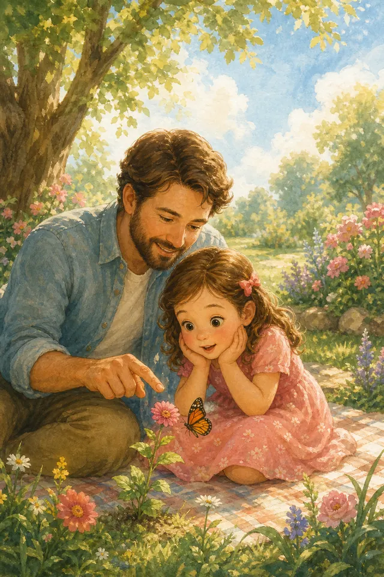{ loading=lazy }

*(Мама или папа показывает на сына)*

Посмотри на свои ручки — ими можно строить башни и обнимать. Посмотри на ножки — ими можно бежать к луже и к маме. Знаешь, кто их придумал?
Бог! Он великий Творец. Он создал огромное солнце, пушистые облака, высоких жирафов и маленьких ящерок. Но самое Его прекрасное творение — это ТЫ.

Когда Бог создавал тебя, Он улыбался. Он выбрал цвет твоих глаз, форму твоего носика и твой звонкий смех. В целом мире нет такого мальчика, как ты. Ты — Его драгоценность. Божий мальчик. Сын Царя.

**📖 Стих из Библии:**
13. Ибо Ты устроил внутренности мои и соткал меня во чреве матери моей. 14. Славлю Тебя, потому что я дивно устроен. Дивны дела Твои, и душа моя вполне сознает это.
Псалом 138:13-14 (Синодальный перевод)

**🗣 Поговорим:**
*Родитель:* Как ты думаешь, что Богу больше всего нравится в тебе? Твоя улыбка? Твоя смелость? Твои добрые руки?
*(Дать сыну ответить)*

**🙏 Наша молитва:**
«Дорогой Бог, спасибо Тебе за то, что Ты создал меня таким особенным. Спасибо за мои глазки, ручки и за то, что Ты меня очень любишь. Аминь.»

---

## Глава 2. Бог любит тебя всегда

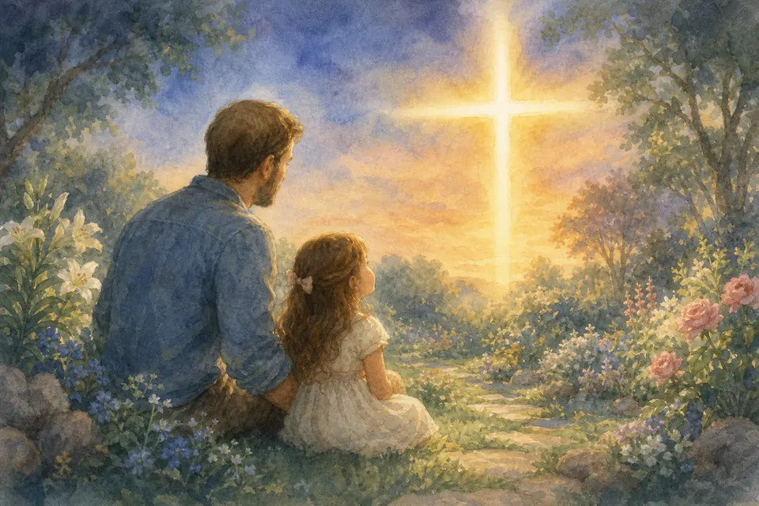{ loading=lazy }

*(Мама или папа говорит мягко и уверенно)*

Представь: ты и мама с папой — одна команда. Даже если сегодня был «день грозы» внутри — топнул, надулся, сказал резко — Божья любовь не заканчивается. Не уменьшается, когда ты ошибся. Не покупается «хорошим поведением», как конфетка в магазине.

Бог любит тебя утром и вечером, в садике и дома, когда весело и когда грустно. Как мы любим тебя даже в трудный день — только Его любовь ещё сильнее и совершеннее.
Ты никогда не бываешь «лишней» для Бога. Никогда.

**📖 Стих из Библии:**
3. Издали явился мне Господь и сказал: любовью вечною Я возлюбил тебя и потому простер к тебе благоволение.
Иеремия 31:3 (Синодальный перевод)

**🗣 Поговорим:**
*Родитель:* Когда тебе особенно нужно вспомнить, что Бог тебя любит?
*(Дать сыну ответить)*

**🙏 Наша молитва:**
«Бог, спасибо, что Ты любишь меня всегда — даже когда мне трудно. Помоги мне чувствовать Твою любовь каждый день. Аминь.»

---

## Глава 3. Библия — письмо от Бога

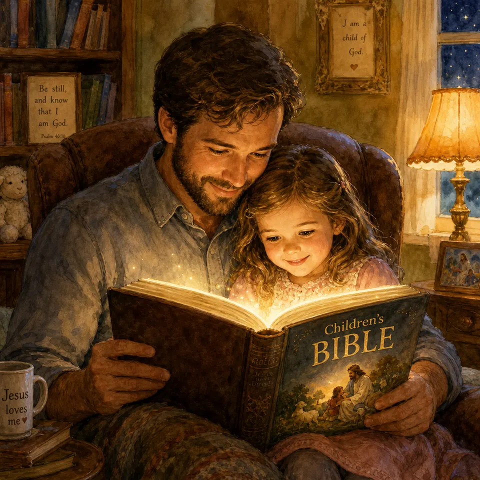{ loading=lazy }

*(Мама или папа показывает Библию или детскую Библию с картинками)*

Представь: тебе пришло письмо от самого главного Царя! Только это письмо — особенное. Оно называется **Библия**.

В Библии Бог рассказывает, кто Он такой, как Он спасает людей и как жить мудро и радостно. Мы читаем её не чтобы «набрать баллов», а чтобы узнать Его сердце.

Детская Библия с картинками — тоже настоящая помощь. Через истории Бог говорит даже самым маленьким. Это письмо — для нашей семьи.

**📖 Стих из Библии:**
16. Все Писание богодухновенно и полезно для научения, для обличения, для исправления, для наставления в праведности, 17. да будет совершен Божий человек, ко всякому доброму делу приготовлен.
2 Тимофею 3:16-17 (Синодальный перевод)

**🗣 Поговорим:**
*Родитель:* Какая библейская история тебе больше всего нравится?
*(Дать сыну ответить)*

**🙏 Наша молитва:**
«Господь, спасибо за Твою книгу. Научи нас любить Библию и понимать Твои слова. Аминь.»

---

## Глава 4. Иисус — Друг и Спаситель

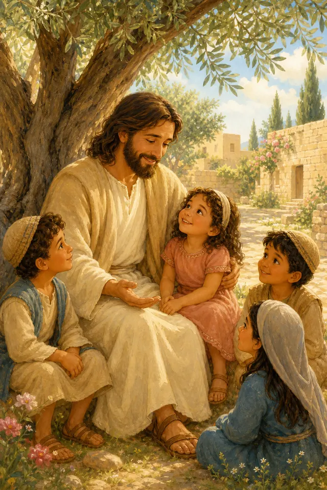{ loading=lazy }

*(Мама или папа говорит с теплом)*

Тук-тук сердце. Сейчас будет важный секрет. Иисус — Сын Божий. Он пришёл на землю, жил среди людей, исцелял больных, учил добру и обнимал детей. Он — твой лучший Друг.

Иногда мы делаем плохое: обижаем, врём, жадничаем. Это называется **грех** — когда мы идём мимо добра. Но Иисус умер на кресте и воскрес, чтобы простить нас и вернуть к Богу.

С Иисусом можно говорить обо всём. Он не смеётся над твоими слезами. Он рядом.

**📖 Стих из Библии:**
12. Сия есть заповедь Моя, да любите друг друга, как Я возлюбил вас. 13. Нет больше той любви, как если кто положит душу свою за друзей своих.
Иоанна 15:12-13 (Синодальный перевод)

**🗣 Поговорим:**
*Родитель:* Как ты думаешь, Иисус рад, когда ты приходишь к Нему?
*(Дать сыну ответить)*

**🙏 Наша молитва:**
«Иисус, спасибо, что Ты мой Друг и Спаситель. Спасибо, что Ты прощаешь и любишь меня. Аминь.»

---

## Глава 5. Что такое молитва

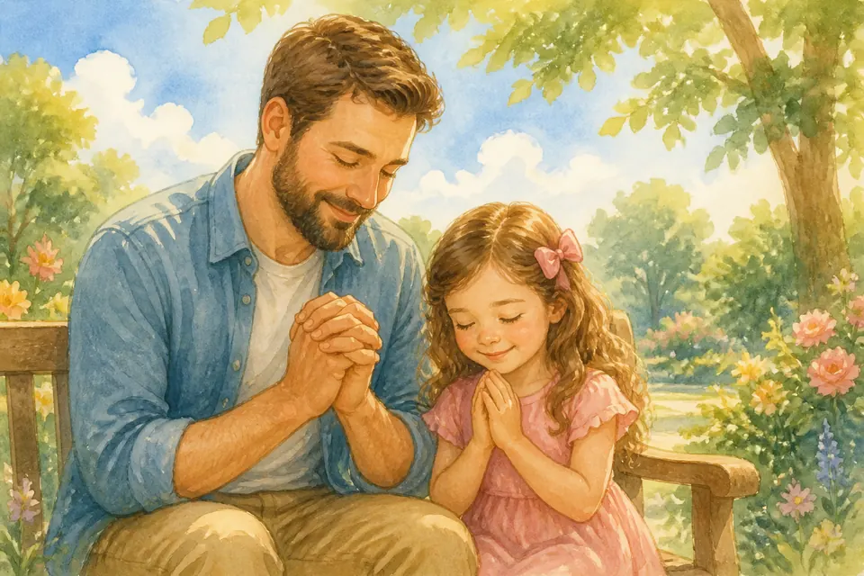{ loading=lazy }

*(Мама или папа улыбается и чуть прикрывает глаза, как будто шепчет секрет)*

Ух ты! Даже обычный день может стать квестом. Знаешь, что такое **молитва**? Это разговор с Богом. Не как с игрушкой и не как с телевизором. Как с самым любящим Папой на Небесах — только Он ещё ближе, чем кажется.

Иногда мы думаем: «Если Бог на Небесах, как же Он меня услышит? У меня ведь нет такого длинного телефона!»
Но Богу не нужен телефон. Он слышит даже то, о чём ты думаешь про себя. Можно говорить вслух, шёпотом или только сердцем — Он всё равно рядом.

Молитва бывает разная, как разные цвета в коробке карандашей:
«Спасибо» — когда радостно.
«Прости» — когда ошибся.
«Помоги» — когда трудно.
«Благослови маму и папу» — когда любишь.

Ты можешь молиться где угодно: в садике, в машине, на скамейке в парке, перед супом и вечером в кроватке. Молитва не обязана быть длинной. Бог слышит и два слова «Иисус, помоги», и честное «я отвлёкся, но снова здесь». Иногда ответ приходит не сразу, но Он всё равно внимательно слушает — потому что ты Его любимый сын.

**📖 Стих из Библии:**
6. Не заботьтесь ни о чем, но всегда в молитве и прошении с благодарением открывайте свои желания пред Богом, 7. и мир Божий, который превыше всякого ума, соблюдет сердца ваши и помышления ваши во Христе Иисусе.
Филиппийцам 4:6-7 (Синодальный перевод)

**🗣 Поговорим:**
*Родитель:* О чём бы ты хотел рассказать Богу прямо сейчас — «спасибо», «прости» или «помоги»?
*(Дать сыну ответить)*

**🙏 Наша молитва:**
«Дорогой Бог, спасибо, что молитва — это разговор с Тобой. Спасибо, что Ты всегда меня слышишь. Аминь.»

---

## Глава 6. Что значит быть христианином?

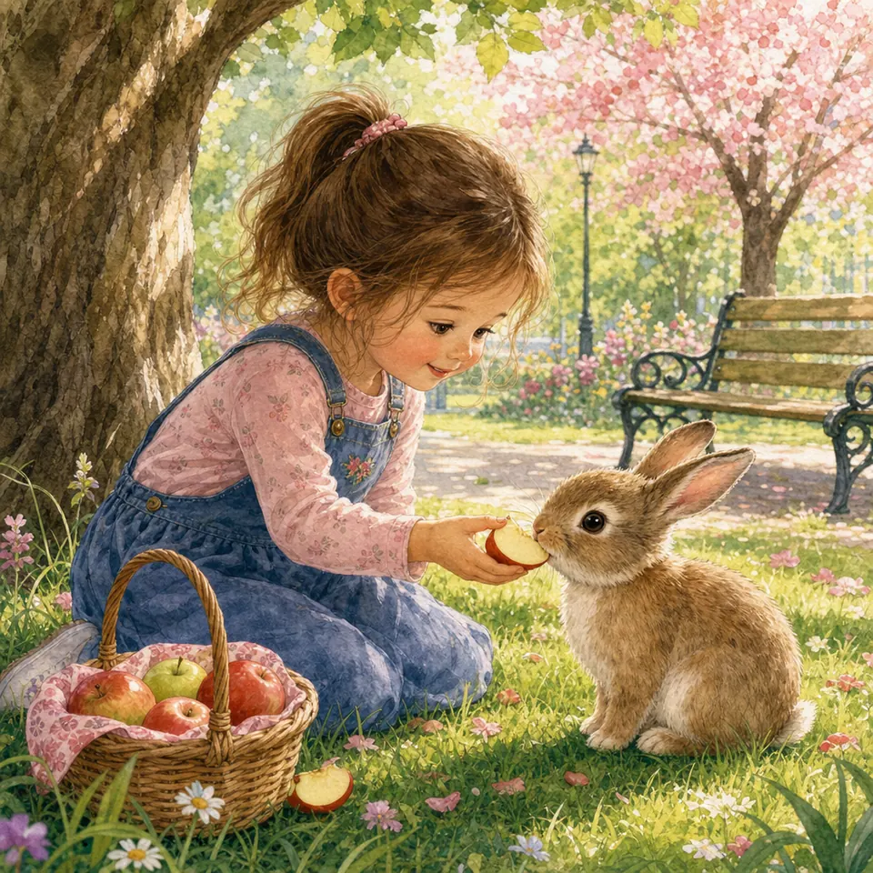{ loading=lazy }

*(Мама или папа объясняет просто)*

Ш-ш-ш… А теперь — внимание, мой герой. Христианин — это человек, который доверяет Иисусу и учится жить, как Он учит: любить Бога и людей.

Это не только «ходить в здание по воскресеньям». Это доброта дома, честность в игре, прощение после ссоры, забота о том, кому трудно.

Ты уже можешь быть маленьким последовательницей Иисуса — своими шажками, своей улыбкой, своим «спасибо» и «прости».

**📖 Стих из Библии:**
12. А тем, которые приняли Его, верующим во имя Его, дал власть быть чадами Божиими, 13. которые ни от крови, ни от хотения плоти, ни от хотения мужа, но от Бога родились.
Иоанна 1:12-13 (Синодальный перевод)

**🗣 Поговорим:**
*Родитель:* Какой добрый поступок ты можешь сделать завтра?
*(Дать сыну ответить)*

**🙏 Наша молитва:**
«Иисус, научи меня быть Твоей мальчиком каждый день — дома, в садике и в игре. Аминь.»

---

## Глава 7. Церковь — большая Божья семья

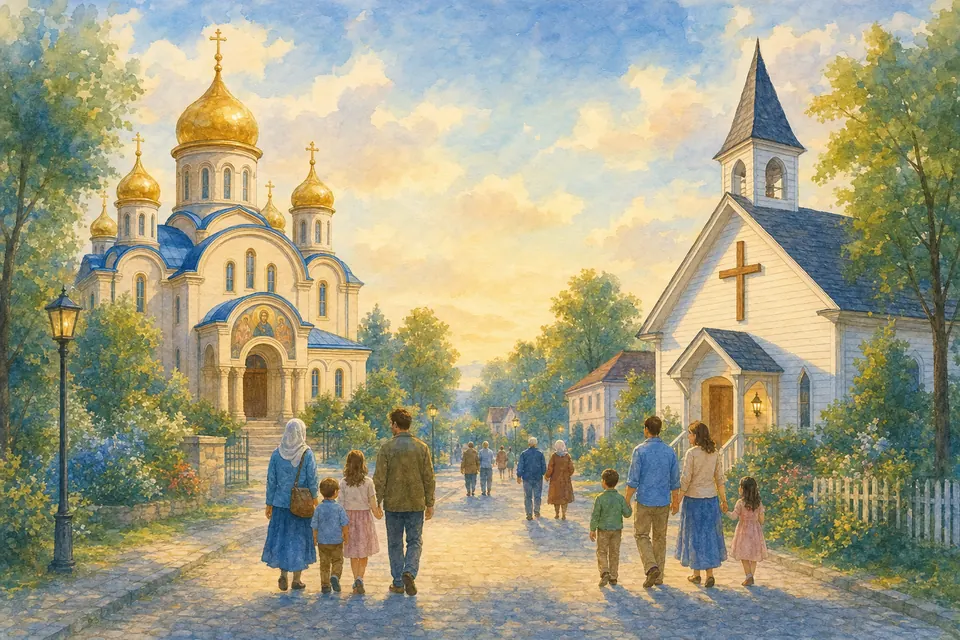{ loading=lazy }

*(Мама или папа вспоминает воскресное утро)*

Топ-топ по полу — и мы уже в истории. Церковь — это не стены и не стулья. Это люди, которые любят Иисуса. Мы вместе молимся, поём, учимся и поддерживаем друг друга.

В церкви есть место и для маленьких: слушать историю, рисовать, петь, обнимать друзей по вере. Ты нужна в Божьей семье. Там тебя любят не за оценки — а потому что ты Божья сын.

**📖 Стих из Библии:**
24. Будем внимательны друг ко другу, поощряя к любви и добрым делам; 25. не будем оставлять собрания своего, как есть у некоторых обычай; но будем увещевать друг друга, и тем более, чем более усматриваете приближение дня оного.
Евреям 10:24-25 (Синодальный перевод)

**🗣 Поговорим:**
*Родитель:* Что тебе нравится в церкви больше всего?
*(Дать сыну ответить)*

**🙏 Наша молитва:**
«Господь, спасибо за Твою церковь. Помоги мне радоваться Божьей семье и быть доброй к людям. Аминь.»

---

## Глава 8. Православный храм

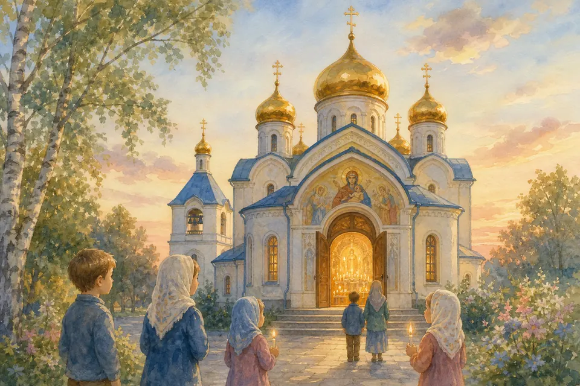{ loading=lazy }

*(Мама или папа говорит уважительно)*

Слышишь? Как будто где-то стучит барабан приключения… Иногда мы видим красивый храм с куполами, свечами и тихим пением. Это православный храм. Люди приходят туда молиться Богу, стоят благоговейно, иногда зажигают свечи.

Если мы зайдём в гости в такой дом молитвы — говорим тихо, не бегаем, уважаем чужой праздник. Христиане могут молиться по-разному. Но Иисус один. И любовь к Богу важнее внешней формы.

Мы радуемся, когда люди ищут Бога искренне.

**📖 Стих из Библии:**
23. Но настанет время и настало уже, когда истинные поклонники будут поклоняться Отцу в духе и истине, ибо таких поклонников Отец ищет Себе. 24. Бог есть дух, и поклоняющиеся Ему должны поклоняться в духе и истине.
Иоанна 4:23-24 (Синодальный перевод)

**🗣 Поговорим:**
*Родитель:* Почему важно вести себя тихо и уважительно в чужом доме молитвы?
*(Дать сыну ответить)*

**🙏 Наша молитва:**
«Господь Иисус, научи нас уважать тех, кто ищет Тебя, даже если их богослужение выглядит иначе. Аминь.»

---

## Глава 9. Наша протестантская дорога

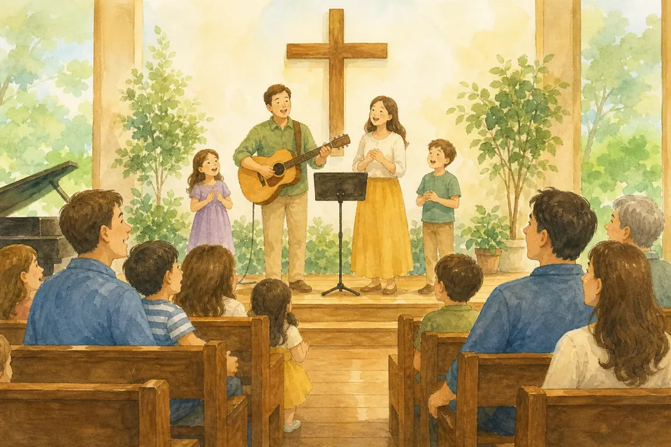{ loading=lazy }

*(Мама или папа про нашу церковь)*

Раз-два! Ноги уже готовы бежать. Мы с тобой идём по протестантской христианской дороге. Часто у нас простое собрание: песни, проповедь из Библии, молитва своими словами, тёплое общение.

Мы особенно ценим Библию как главный ориентир, личную веру в Иисуса и жизнь церкви как семьи. Мы не «против» других христиан. Мы в первую очередь христиане — и рады всякой искренней любви ко Христу.

**📖 Стих из Библии:**
42. И они постоянно пребывали в учении Апостолов, в общении и преломлении хлеба и в молитвах.
Деяния 2:42 (Синодальный перевод)

**🗣 Поговорим:**
*Родитель:* Что ты замечаешь в нашем собрании: песни, истории, друзей?
*(Дать сыну ответить)*

**🙏 Наша молитва:**
«Иисус, спасибо за нашу церковь. Помоги нам любить Тебя, Библию и людей. Аминь.»

---

## Глава 10. Рай, надежда и Добрый Пастырь

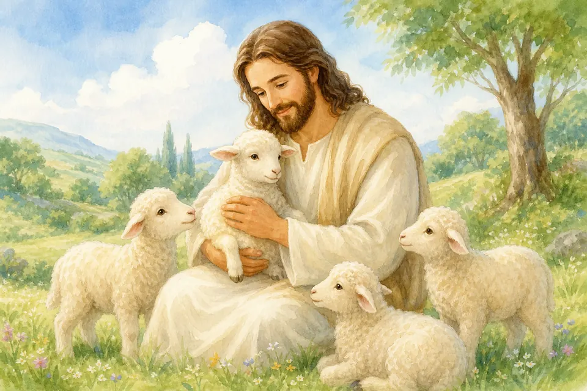{ loading=lazy }

*(Мама или папа говорит спокойно, без страшилок)*

Представь: ты и мама с папой — одна команда. **Рай** — это быть с Богом в вечной радости, где нет боли и зла.
Иногда взрослые говорят и про **ад** — жизнь без Бога, без Его света. Мы не пугаем тебя страшными картинками. Мы говорим о **надежде**.

Иисус — Добрый Пастырь. Он зовёт нас к Себе. Бог хочет, чтобы люди были с Ним. Если тебе вдруг станет тревожно — держись за руку Иисуса в молитве. Он ведёт к свету.

**📖 Стих из Библии:**
3. И услышал я громкий голос с неба, говорящий: се, скиния Бога с человеками, и Он будет обитать с ними; они будут Его народом, и Сам Бог с ними будет Богом их. 4. И отрет Бог всякую слезу с очей их, и смерти не будет уже; ни плача, ни вопля, ни болезни уже не будет, ибо прежнее прошло.
Откровение 21:3-4 (Синодальный перевод)

**🗣 Поговорим:**
*Родитель:* Что тебе помогает, когда немного тревожно?
*(Дать сыну ответить)*

**🙏 Наша молитва:**
«Иисус, Ты мой Добрый Пастырь. Веди меня к Своему свету и наполни сердце надеждой. Аминь.»

---

## Глава 11. Праздники веры

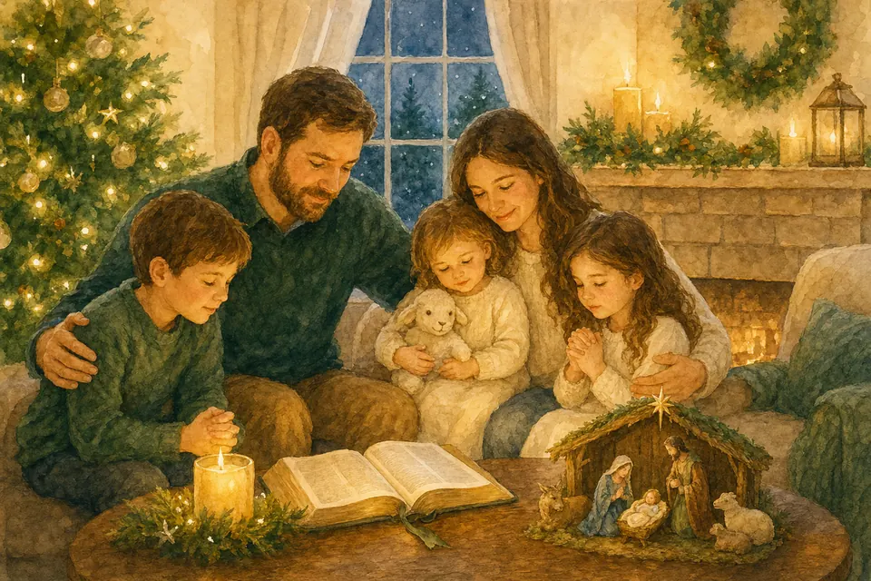{ loading=lazy }

*(Мама или папа вспоминает Рождество и Пасху)*

**Рождество** — мы радуемся: Иисус родился! Бог дал миру самый лучший подарок.
**Пасха** — мы радуемся ещё сильнее: Иисус воскрес! Смерть и зло не победили Его.

Праздник — не только торт и красивое одежда. Это благодарность Богу и добро к людям: открытка бабушке, угощение, песня вместе, тёплое «я тебя люблю».

**📖 Стих из Библии:**
3. Ибо я первоначально преподал вам, что и сам принял, то есть, что Христос умер за грехи наши, по Писанию, 4. и что Он погребен был, и что воскрес в третий день, по Писанию,
1 Коринфянам 15:3-4 (Синодальный перевод)

**🗣 Поговорим:**
*Родитель:* Какой праздник тебе больше всего нравится и почему?
*(Дать сыну ответить)*

**🙏 Наша молитва:**
«Господь, спасибо за Рождество и Пасху. Научи нас радоваться Тебе и делиться радостью. Аминь.»

---

## Глава 12. Мир, который Бог нам доверил

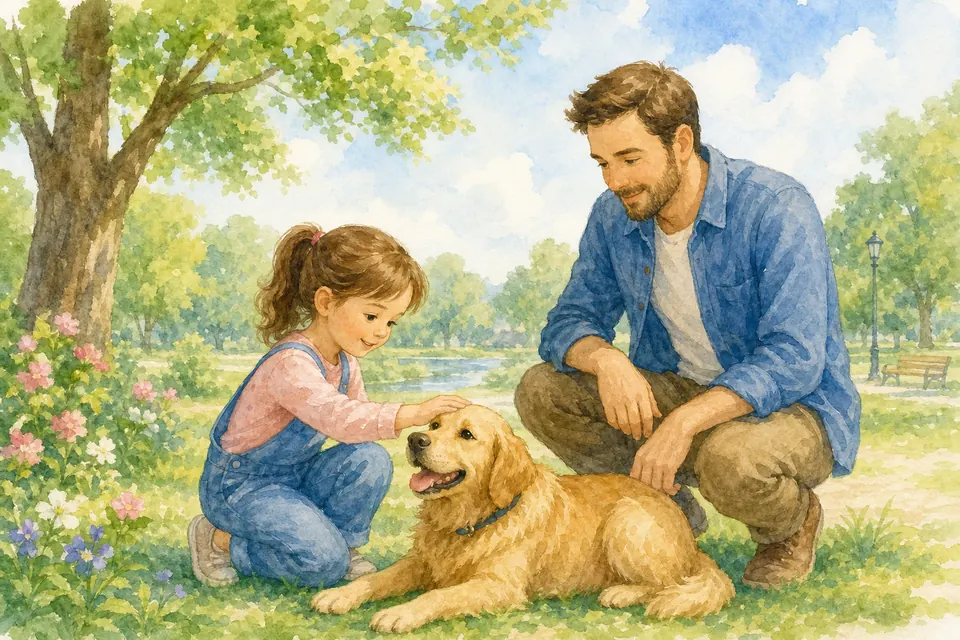{ loading=lazy }

*(Мама или папа и сын смотрят в окно воображением)*

Тук-тук сердце. Сейчас будет важный секрет. Бог создал красивый мир и попросил людей о нём заботиться. Не мусорить, беречь воду, быть добрыми к животным, помогать людям.

Маленькая мальчик тоже может: убрать фантик, полить цветок, накормить кошку, сказать «спасибо» за еду. Животных любим мудро: не мучаем, не тянем за хвост и не лезем к незнакомой собаке без взрослого. Это тоже служение Богу — руками и глазами, которые замечают красоту.

**📖 Стих из Библии:**
1. Господня - земля и что наполняет ее, вселенная и все живущее в ней, 2. ибо Он основал ее на морях и на реках утвердил ее.
Псалом 23:1-2 (Синодальный перевод)

**🗣 Поговорим:**
*Родитель:* Какую одну заботу о мире ты возьмёшь на этой неделе?
*(Дать сыну ответить)*

**🙏 Наша молитва:**
«Творец, спасибо за Твой прекрасный мир. Научи меня беречь его с любовью. Аминь.»

## Глава 241. Бог сделал меня сильным и добрым

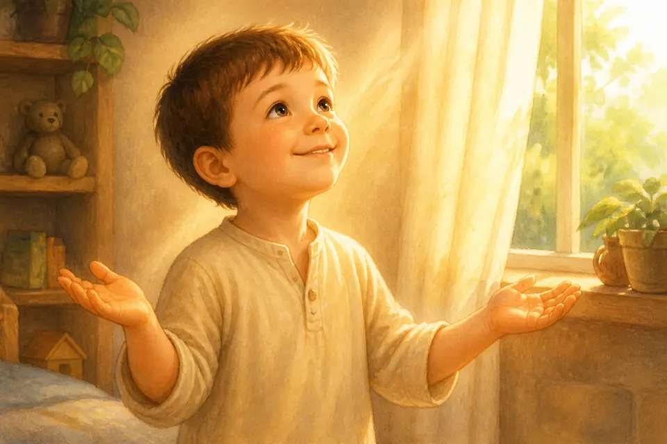{ loading=lazy }

*(Мама или папа кладёт руку на плечо сына)*

Топ-топ! Ты бежишь. Бах! Строишь башню. И ещё умеешь пожалеть друга.

Бог задумал тебя сильным и добрым сразу. Не «или-или». Сила без доброты пугает. Доброта без смелости прячется. Вместе — это Божий мальчик, сын Царя.

**📖 Стих из Библии:**
14. Славлю Тебя, потому что я дивно устроен. Дивны дела Твои, и душа моя вполне сознает это.
Псалом 138:14 (Синодальный перевод)

**🗣 Поговорим:**
*Родитель:* Где ты сегодня можешь быть и сильным, и добрым?
*(Дать сыну ответить)*

**🙏 Наша молитва:**
«Бог, спасибо, что сделал меня сильным и добрым. Аминь.»

---

