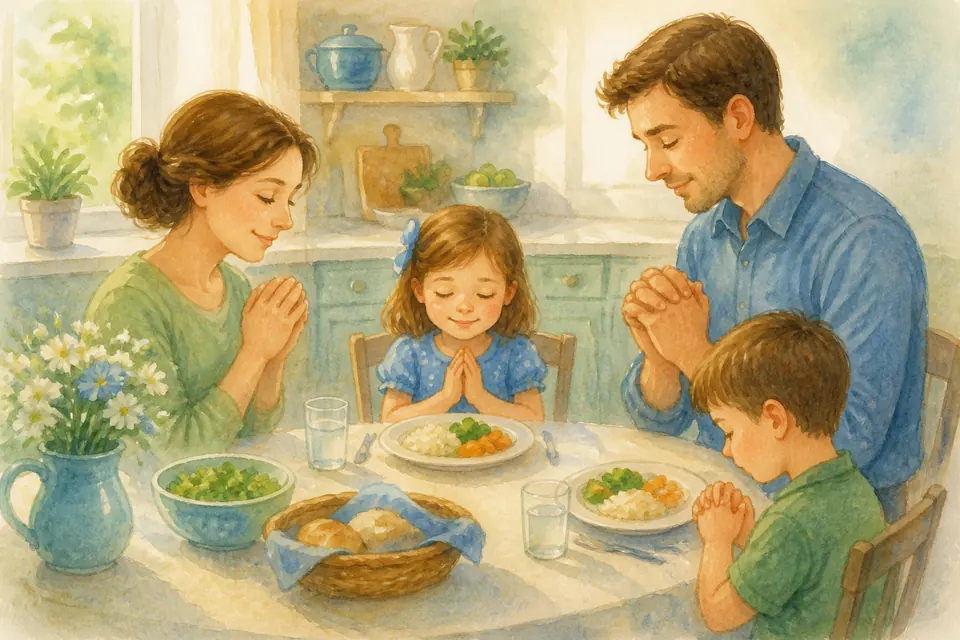
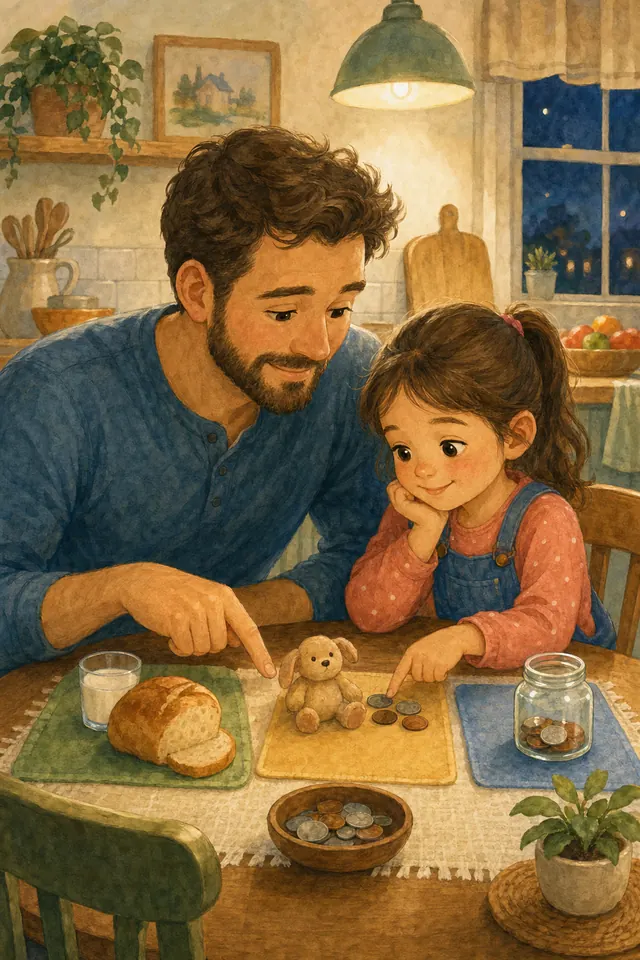
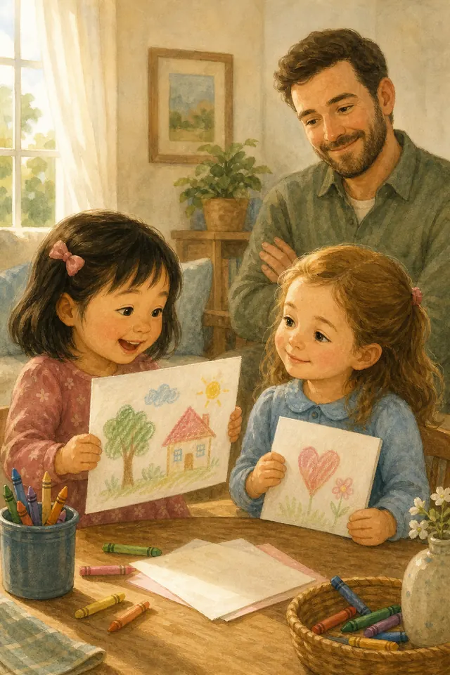
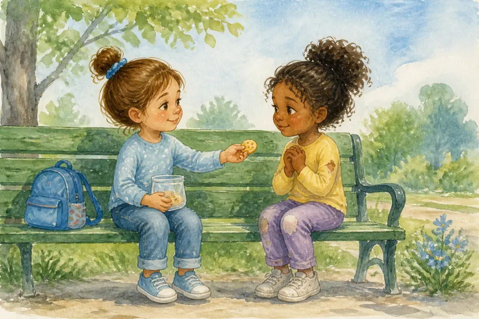
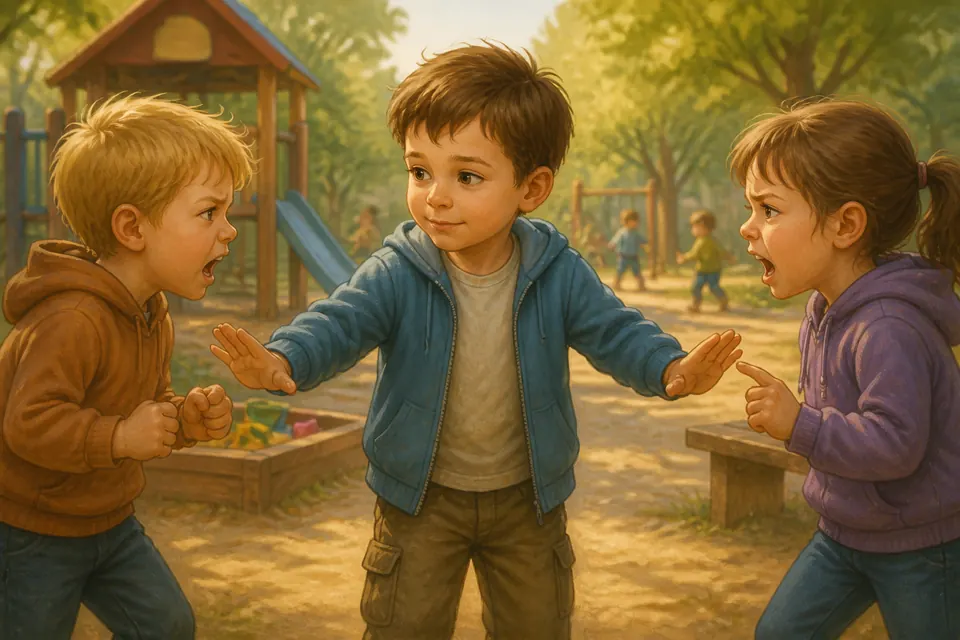
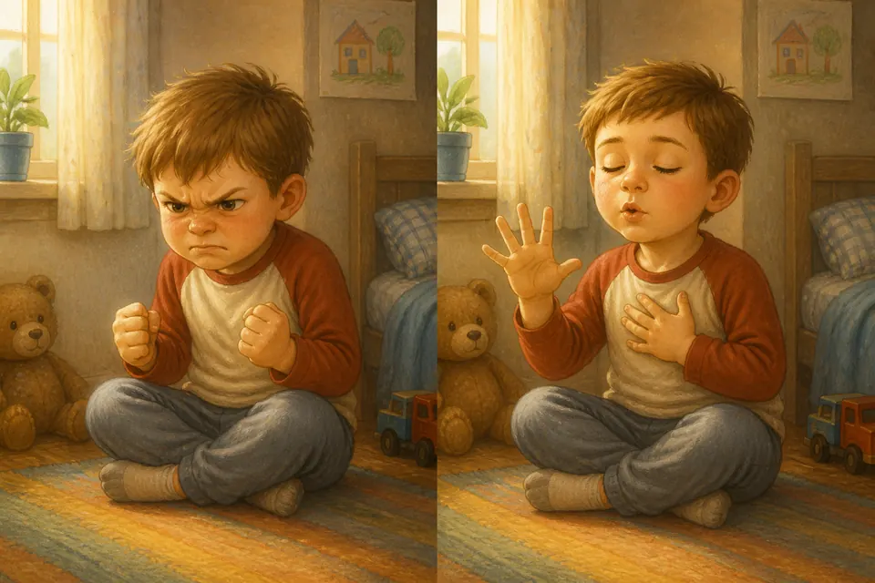

## В этой части

- [Глава 64. Сон — тоже Божий подарок](#ch-64)
- [Глава 65. Еда без капризов и «спасибо» за стол](#ch-65)
- [Глава 66. Деньги: «хочу» и «нужно»](#ch-66)
- [Глава 67. Правда и ложь](#ch-67)
- [Глава 68. Зависть и сравнение](#ch-68)
- [Глава 69. Хвастовство и скромность](#ch-69)
- [Глава 70. Терпение и ожидание](#ch-70)
- [Глава 71. Щедрость и помощь нуждающимся](#ch-71)
- [Глава 72. Труд и лень](#ch-72)
- [Глава 73. Благодарность как привычка](#ch-73)
- [Глава 214. Покаяние: сказать «прости» и идти дальше](#ch-214)
- [Глава 215. Благодарить Бога в обычном дне](#ch-215)
- [Глава 220. Сила — чтобы делать добро](#ch-220)
- [Глава 221. Смелость — это не драка](#ch-221)
- [Глава 222. Настоящие герои](#ch-222)
- [Глава 223. Защитник без насилия](#ch-223)
- [Глава 224. Обещание — это мост](#ch-224)
- [Глава 225. Когда злюсь: считаем до пяти](#ch-225)

## Глава 64. Сон — тоже Божий подарок

{ loading=lazy }

*(Мама или папа говорит тише, почти шёпотом)*

Слышишь? Как будто где-то стучит барабан приключения… Знаешь, даже сильным людям нужен сон. Сон — не наказание и не «скука». Это Божий подарок: тело отдыхает, сердце успокаивается, мозг складывает день по полочкам.

Когда мы ложимся вовремя, завтра легче быть доброй и внимательной. Ночник, объятие, молитва — и глазки отдыхают. Если спишь в гостях или дома шумит малыш, можно сказать взрослым, что тебе нужна помощь и тишина. Мы рядом.

**📖 Стих из Библии:**
9. Спокойно ложусь я и сплю, ибо Ты, Господи, един даешь мне жить в безопасности.
Псалом 4:9 (Синодальный перевод)

**🗣 Поговорим:**
*Родитель:* Что тебе помогает быстрее заснуть?
*(Дать сыну ответить)*

**🙏 Наша молитва:**
«Господь, благослови мой сон. Храни меня ночью. Аминь.»

---

## Глава 65. Еда без капризов и «спасибо» за стол

{ loading=lazy }

*(Мама или папа гладит воображаемую тарелку)*

Раз-два! Ноги уже готовы бежать. Еда — забота Бога через руки мамы, папы, бабушки. Не всегда на столе то, что «самая-самая хотелка». Иногда — суп. Иногда — каша.

Мы учимся пробовать, говорить «спасибо» и не превращать стол в битву. Перед едой можно коротко поблагодарить Бога: «Спасибо за еду и за руки, которые готовили». Капризы делают обед горьким. Благодарность — вкусным даже простому блюду.

**📖 Стих из Библии:**
31. Итак, едите ли, пьете ли, или иное что делаете, все делайте в славу Божию.
1 Коринфянам 10:31 (Синодальный перевод)

**🗣 Поговорим:**
*Родитель:* За какую еду сегодня скажем «спасибо»?
*(Дать сыну ответить)*

**🙏 Наша молитва:**
«Бог, спасибо за еду и за руки, которые готовят. Научи меня быть благодарной. Аминь.»

---

## Глава 66. Деньги: «хочу» и «нужно»

{ loading=lazy }

*(Мама или папа показывает две ладошки)*

Представь: ты и мама с папой — одна команда. В одной ладошке — «хочу»: игрушка, конфетка, модная вещица. В другой — «нужно»: еда, дом, помощь людям, подарки с любовью.

Деньги — инструмент, не царь. Мы не кланяемся витрине. Мы спрашиваем: «Это нужно? Это мудро? Это доброе?» Иногда ответ: «Не сейчас». И это тоже любовь.

**📖 Стих из Библии:**
6. Великое приобретение - быть благочестивым и довольным. 7. Ибо мы ничего не принесли в мир; явно, что ничего не можем и вынести из него. 8. Имея пропитание и одежду, будем довольны тем.
1 Тимофею 6:6-8 (Синодальный перевод)

**🗣 Поговорим:**
*Родитель:* Вспомни, когда «не сейчас» оказалось правильным.
*(Дать сыну ответить)*

**🙏 Наша молитва:**
«Господь, научи меня мудрости: отличать «хочу» от «нужно». Аминь.»

---

## Глава 67. Правда и ложь

{ loading=lazy }

*(Мама или папа смотрит прямо и тепло)*

Бах! День начинается с маленького подвига. Правда — как чистый свет. Ложь — как тень, в которой потом страшно самой.

Иногда врут от страха: «Вдруг накажут». В нашей семье безопаснее сказать правду. Ошибку можно исправить. Ложь запутывает ещё сильнее. Бог любит правду — и помогает быть смелой говорить её мягко. Если ты передумала — скажи честно. Если обещала — доведи до конца или попроси помощи. Если случилось важное или опасное — расскажи взрослому, даже если страшно.

**📖 Стих из Библии:**
25. Посему, отвергнув ложь, говорите истину каждый ближнему своему, потому что мы члены друг другу.
Ефесянам 4:25 (Синодальный перевод)

**🗣 Поговорим:**
*Родитель:* Почему правду иногда говорить трудно — и кто может помочь?
*(Дать сыну ответить)*

**🙏 Наша молитва:**
«Иисус, научи меня правде без страха и злости. Аминь.»

---

## Глава 68. Зависть и сравнение

{ loading=lazy }

*(Мама или папа мягко качает головой)*

Тук-тук сердце. Сейчас будет важный секрет. Зависть шепчет: «У неё лучше — значит, я хуже». Это ядовитый шёпот. Он крадёт радость.

Ты не должен быть копией друзья. У тебя свой путь, свои дары, своя красота. Зависть может прийти к игрушке, платью, вниманию, спокойствию, лёгкой учёбе или красивой фотографии. Можно порадоваться за другую и сказать: «Как здорово у тебя!» — а себе: «Спасибо, Бог, и за меня».

**📖 Стих из Библии:**
30. Кроткое сердце - жизнь для тела, а зависть - гниль для костей.
Притчи 14:30 (Синодальный перевод)

**🗣 Поговорим:**
*Родитель:* Что у тебя есть такого, за что можно сказать «спасибо» без сравнения?
*(Дать сыну ответить)*

**🙏 Наша молитва:**
«Бог, избавь меня от зависти. Научи радоваться за других и за себя. Аминь.»

---

## Глава 69. Хвастовство и скромность

{ loading=lazy }

*(Мама или папа улыбается)*

Хвастовство кричит: «Смотрите, какая я!» Скромность говорит: «Спасибо Богу» — и делится радостью без унижения других.

Можно гордиться старанием. Нельзя топтать чужое сердце. Настоящая сила не орёт громче всех.

**📖 Стих из Библии:**
2. Пусть хвалит тебя другой, а не уста твои, - чужой, а не язык твой.
Притчи 27:2 (Синодальный перевод)

**🗣 Поговорим:**
*Родитель:* Как можно рассказать о своей радости, не хвастаясь?
*(Дать сыну ответить)*

**🙏 Наша молитва:**
«Господь, научи меня скромности и тёплой радости. Аминь.»

---

## Глава 70. Терпение и ожидание

{ loading=lazy }

*(Мама или папа медленно считает до трёх)*

Ждать очередь, ждать день рождения, ждать маму с работы — трудно! Терпение — мышца сердца. Она растёт, когда мы не топаем каждую секунду.

Можно сказать: «Мне трудно ждать» — и подышать, помолиться, найти тихое дело. Бог тоже часто учит нас ждать с любовью.

**📖 Стих из Библии:**
7. Итак, братия, будьте долготерпеливы до пришествия Господня. Вот, земледелец ждет драгоценного плода от земли и для него терпит долго, пока получит дождь ранний и поздний. 8. Долготерпите и вы, укрепите сердца ваши, потому что пришествие Господне приближается.
Иакова 5:7-8 (Синодальный перевод)

**🗣 Поговорим:**
*Родитель:* Что тебе ждать труднее всего?
*(Дать сыну ответить)*

**🙏 Наша молитва:**
«Иисус, научи меня терпению. Помоги ждать спокойно. Аминь.»

---

## Глава 71. Щедрость и помощь нуждающимся

{ loading=lazy }

*(Мама или папа показывает жест «отдать»)*

Топ-топ по полу — и мы уже в истории. Щедрость — когда сердце открывает кулачок: делится игрушкой, печеньем, временем, монеткой для нуждающихся.

Мы помогаем не чтобы «казаться хорошими», а потому что Бог щедр к нам. Бог любит и бедных, и богатых, а ценность человека не измеряется витриной. Маленькая мальчик тоже может быть Божьими руками — очень маленькими, но настоящими.

**📖 Стих из Библии:**
6. При сем скажу: кто сеет скупо, тот скупо и пожнет; а кто сеет щедро, тот щедро и пожнет. 7. Каждый уделяй по расположению сердца, не с огорчением и не с принуждением; ибо доброхотно дающего любит Бог.
2 Коринфянам 9:6-7 (Синодальный перевод)

**🗣 Поговорим:**
*Родитель:* Чем ты можешь поделиться на этой неделе?
*(Дать сыну ответить)*

**🙏 Наша молитва:**
«Господь, сделай моё сердце щедрым. Аминь.»

---

## Глава 72. Труд и лень

{ loading=lazy }

*(Мама или папа потягивается, потом бодро встаёт)*

Лень шепчет: «Пусть другие». Труд говорит: «Я помогу». После труда бывает приятная усталость и радость: «Я смогла!»

Мы не рабы дел. Но мы и не героевы на диване без заботы. Бог даёт руки для добрых дел — дома, в садике, в церкви.

**📖 Стих из Библии:**
23. И все, что делаете, делайте от души, как для Господа, а не для человеков, 24. зная, что в воздаяние от Господа получите наследие, ибо вы служите Господу Христу.
Колоссянам 3:23-24 (Синодальный перевод)

**🗣 Поговорим:**
*Родитель:* Какое маленькое дело ты сделаешь сегодня без каприза?
*(Дать сыну ответить)*

**🙏 Наша молитва:**
«Бог, научи меня трудиться с радостью и не лениться. Аминь.»

---

## Глава 73. Благодарность как привычка

{ loading=lazy }

*(Мама или папа перечисляет на пальцах)*

Раз-два! Ноги уже готовы бежать. Благодарность — очки, через которые мир становится светлее. «Спасибо» за еду, за объятие, за обычный день, за врача, учителя, воспитателя, за Иисуса.

Каждый вечер можно находить три «спасибо». Даже в трудный день найдётся хотя бы одно. Это тренировка радостного сердца.

**📖 Стих из Библии:**
16. Всегда радуйтесь. 17. Непрестанно молитесь. 18. За все благодарите: ибо такова о вас воля Божия во Христе Иисусе.
1 Фессалоникийцам 5:16-18 (Синодальный перевод)

**🗣 Поговорим:**
*Родитель:* Назови три «спасибо» за сегодняшний день.
*(Дать сыну ответить)*

**🙏 Наша молитва:**
«Бог, спасибо Тебе за всё доброе. Научи меня замечать Твои дары. Аминь.»

---

## Глава 214. Покаяние: сказать «прости» и идти дальше

{ loading=lazy }

*(Мама или папа показывает раскрытые ладони — «отпускаем»)*

Ш-ш-ш… А теперь — внимание, мой герой. Покаяние — не страшное взрослое слово. Это когда сердце говорит: «Я сделал нехорошо. Прости, Бог. Прости, мама/папа/друг. Помоги поступить иначе».

После «прости» бывает легко и светло. Бог не держит список, чтобы тебя стыдить. Он радуется возвращению — как отец в притче радуется ребёнку, который пришёл домой.

Мы тоже учимся принимать извинение и не припоминать зло каждый день.

**📖 Стих из Библии:**
9. Если исповедуем грехи наши, то Он, будучи верен и праведен, простит нам грехи наши и очистит нас от всякой неправды.
1 Иоанна 1:9 (Синодальный перевод)

**🗣 Поговорим:**
*Родитель:* Легко ли тебе говорить «прости» — или иногда язык не слушается?
*(Дать сыну ответить)*

**🙏 Наша молитва:**
«Бог, научи меня честно просить прощения и принимать Твоё прощение с радостью. Аминь.»

---

## Глава 215. Благодарить Бога в обычном дне

{ loading=lazy }

*(Мама или папа оглядывает комнату глазами «спасибо»)*

Топ-топ по полу — и мы уже в истории. Благодарить Бога можно не только за праздник. За тёплые носки. За воду из крана. За смех. За то, что зубы почистились. За то, что мама нашёлсь, когда звала.

Обычный день — полный Божьих подарков, если смотреть внимательно. «Спасибо, Бог» можно шептать по дороге в сад, за столом и перед сном.

Благодарность делает сердце мягким и зорким.

**📖 Стих из Библии:**
18. За все благодарите: ибо такова о вас воля Божия во Христе Иисусе.
1 Фессалоникийцам 5:18 (Синодальный перевод)

**🗣 Поговорим:**
*Родитель:* Какое самое обычное «спасибо Богу» у тебя есть прямо сейчас?
*(Дать сыну ответить)*

**🙏 Наша молитва:**
«Бог, спасибо за этот обычный день. Научи меня замечать Твои дары. Аминь.»

## Глава 220. Сила — чтобы делать добро

{ loading=lazy }

*(Мама или папа сгибает руку «мышцей» и улыбается)*

Бууум! Представь: ты поднимаешь тяжёлый рюкзак… или толкаешь диван-«ракету». Сила — это здорово!

Но настоящая сила Божьего мальчика — не чтобы отнимать игрушку. А чтобы помочь младшему, отнести маме сумку, защитить слабого словами и позвать взрослого. Сильные руки — для добра.

**📖 Стих из Библии:**
13. Все могу в укрепляющем меня Иисусе Христе.
Филиппийцам 4:13 (Синодальный перевод)

**🗣 Поговорим:**
*Родитель:* Кому ты сегодня можешь помочь своей силой?
*(Дать сыну ответить)*

**🙏 Наша молитва:**
«Иисус, дай мне силу для добра — помогать, а не обижать. Аминь.»

---

## Глава 221. Смелость — это не драка

{ loading=lazy }

*(Мама или папа говорит твёрдо, но спокойно)*

Иногда кажется: кто громче кричит и сильнее толкает — тот «крутой». Но это не смелость. Это шум.

Настоящая смелость — сказать «стоп», отойти, позвать взрослого, признать ошибку. Как Давид: он был храбрым с Богом, а не потому что любил драться ради драки. Мой герой выбирает мир, где можно.

**📖 Стих из Библии:**
9. Блаженны миротворцы, ибо они будут наречены сынами Божиими.
Матфея 5:9 (Синодальный перевод)

**🗣 Поговорим:**
*Родитель:* Что смелее — ударить или позвать на помощь?
*(Дать сыну ответить)*

**🙏 Наша молитва:**
«Бог, научи меня смелости без драки. Аминь.»

---

## Глава 222. Настоящие герои

{ loading=lazy }

*(Мама или папа широко разводит руки, как плащ супергероя)*

Вуш! Плащ! Маска! Динозавр-защитник! Играть в героев весело.

А настоящие герои рядом: пожарный, врач, учитель, мама и папа, которые трудятся и молятся. И самый главный Герой — Иисус. Он спас нас любовью, а не кулаками напоказ. Ты тоже можешь быть героем дня: честным, добрым, смелым.

**📖 Стих из Библии:**
7. Никому не воздавайте злом за зло, но пекитесь о добром перед всеми человеками.
Римлянам 12:17 (Синодальный перевод)

**🗣 Поговорим:**
*Родитель:* Кто твой любимый настоящий герой — и почему?
*(Дать сыну ответить)*

**🙏 Наша молитва:**
«Иисус, будь моим Героем. Научи меня доброй смелости. Аминь.»

---

## Глава 223. Защитник без насилия

{ loading=lazy }

*(Мама или папа ставит ладонь «щитом» перед собой)*

Представь: на площадке кто-то обижает малыша. Сердце стучит: «Надо защитить!»

Защитник Божий не обязан бить. Он может встать рядом, сказать громко: «Так нельзя!», увести друга и позвать взрослого. Щит — это смелые слова и умная помощь. Ты — чемпион сердца, когда бережёшь других без злости.

**📖 Стих из Библии:**
12. Милостивые очи Господа — на праведных, и уши Его — к молитве их.
1 Петра 3:12 (Синодальный перевод)

**🗣 Поговорим:**
*Родитель:* Как можно защитить друга без драки?
*(Дать сыну ответить)*

**🙏 Наша молитва:**
«Господь, сделай меня защитником добрым и мудрым. Аминь.»

---

## Глава 224. Обещание — это мост

{ loading=lazy }

*(Мама или папа соединяет указательные пальцы «мостиком»)*

Тук-тук! Ты сказал: «Я приду играть после обеда». Друг ждёт. Обещание — как мост: по нему ходят доверие.

Если не можешь сдержать — скажи честно заранее. Лучше маленький честный мост, чем большой обманный. Бог верен в Своих обещаниях — и мы учимся быть верными в маленьких.

**📖 Стих из Библии:**
37. Но да будет слово ваше: да, да; нет, нет; а что сверх этого, то от лукавого.
Матфея 5:37 (Синодальный перевод)

**🗣 Поговорим:**
*Родитель:* Какое обещание ты сможешь сдержать завтра?
*(Дать сыну ответить)*

**🙏 Наша молитва:**
«Бог, научи меня держать слово. Аминь.»

---

## Глава 225. Когда злюсь: считаем до пяти

{ loading=lazy }

*(Мама или папа показывает пять пальцев и медленно загибает)*

Сердце колотится! Хочется крикнуть, кинуть кубик, топнуть. Злость — как пар в чайнике: если сразу рвануть крышку — обожжёшься.

Стоп. Вдох. Раз… два… три… четыре… пять. Потом слова: «Я злюсь. Мне нужна помощь». Злость не делает тебя плохим. Плохо — бить. Хорошо — сосчитать и сказать.

**📖 Стих из Библии:**
26. Гневаясь, не согрешайте: солнце да не зайдет во гневе вашем.
Ефесянам 4:26 (Синодальный перевод)

**🗣 Поговорим:**
*Родитель:* Давай вместе посчитаем до пяти, когда представим сильную злость?
*(Дать сыну ответить)*

**🙏 Наша молитва:**
«Иисус, когда я злюсь, помоги мне посчитать до пяти и не ударить. Аминь.»

---

