## В этой части

- [Глава 186. Девочки и мальчики — разные и одинаково любимые](#ch-186)
- [Глава 187. Когда тело начнёт меняться](#ch-187)
- [Глава 188. У тела есть настоящие имена](#ch-188)
- [Глава 189. Вопросы про тело — к маме и папе](#ch-189)
- [Глава 190. Добрые и недобрые прикосновения](#ch-190)
- [Глава 191. Даже знакомый может поступить плохо](#ch-191)
- [Глава 192. Хитрая «игра» и особые подарки](#ch-192)
- [Глава 193. Если бьют, держат или сильно пугают](#ch-193)
- [Глава 194. Кричи. Уходи. Расскажи. И ещё раз](#ch-194)
- [Глава 195. Ты не виноват](#ch-195)
- [Глава 196. Никаких фото личных мест](#ch-196)
- [Глава 197. Осмотр тела — только с мамой или папой](#ch-197)

## Глава 186. Девочки и мальчики — разные и одинаково любимые

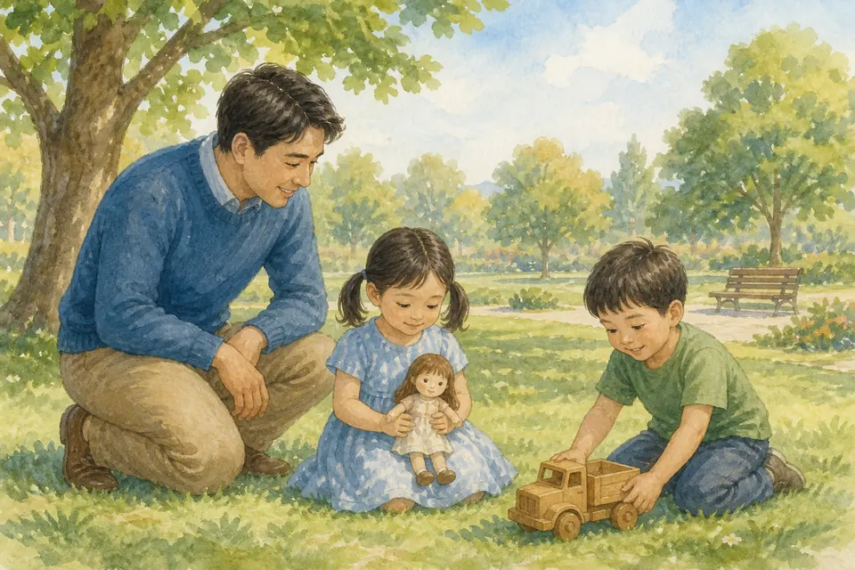{ loading=lazy }

*(Мама или папа говорит тепло и ясно)*

Бах! На площадке кто-то орёт «только мальчики!» — а рядом девочка тоже хочет в игру. Бог создал людей мужчиной и женщиной. Девочки и мальчики разные — и это хорошо. У нас разное тело. Разные голоса. Иногда разные игры. Но ценность перед Богом одна: каждый человек — Его любимое творение.

В пять лет дружба — это дружба. Мы играем честно, не заглядываем под одежду, не дразним тело другого ребёнка и не играем во «взрослые» секреты. Уважение начинается с простого: не трогать личное, не смеяться, сказать «мне так не нравится».

Ты — мальчик. Это дар, а не экзамен. И девочка рядом — тоже Божий ребёнок, а не враг и не «невеста».

**📖 Стих из Библии:**
27. И сотворил Бог человека по образу Своему, по образу Божию сотворил его; мужчину и женщину сотворил их.
Бытие 1:27 (Синодальный перевод)

**🗣 Поговорим:**
*Родитель:* Чем девочки и мальчики похожи — и чем они разные?
*(Дать сыну ответить)*

**🙏 Наша молитва:**
«Бог, спасибо, что Ты создал меня мальчиком. Научи уважать и девочек, и мальчиков. Аминь.»

---

## Глава 187. Когда тело начнёт меняться

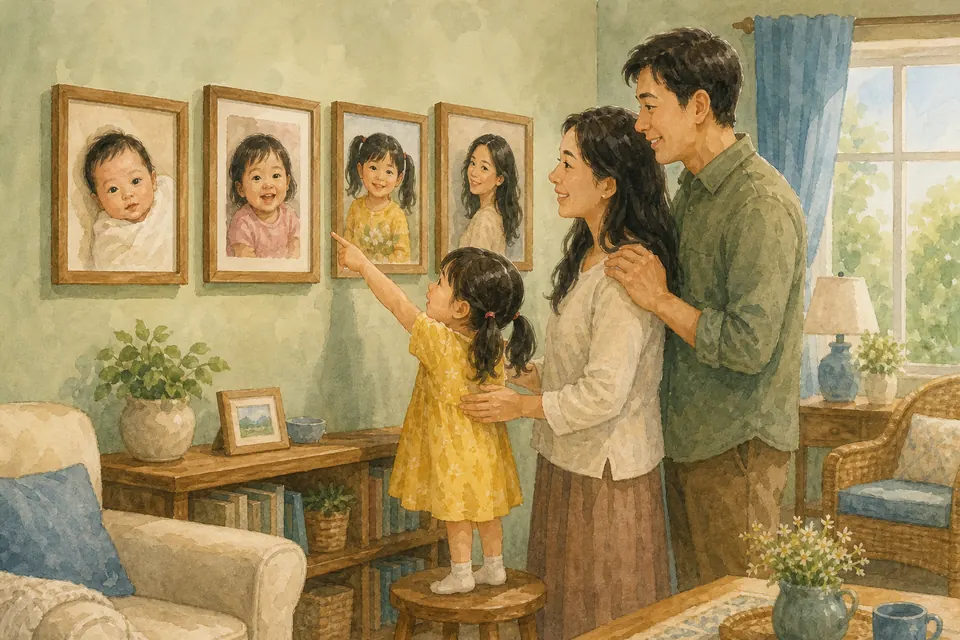{ loading=lazy }

*(Мама или папа говорит спокойно, без спешки и без страха)*

Сейчас тебе пять. Ты бегаешь, строишь, прыгаешь в лужу — и это прекрасное детское тело. Оно растёт медленно: выше становишься, сильнее, умнее, ловчее. Это уже большое чудо.

Позже, когда ты будешь гораздо старше — ближе к тому возрасту, когда мальчик растёт во взрослого мужчину, — тело изменится ещё. Голос может стать ниже. Появятся новые волоски. Плечи шире. Это не страшно и не «сломалось». Так Бог устроил тело мужчины.

Сейчас тебе этого не нужно. Не надо торопить. Не сравнивай себя с другими: у всех свой срок, как у деревьев в саду. Если услышишь странное слово в садике — не пугайся. Спроси меня или маму. Мы расскажем правду по возрасту.

**📖 Стих из Библии:**
1. Всему свое время, и время всякой вещи под небом.
Екклесиаст 3:1 (Синодальный перевод)

**🗣 Поговорим:**
*Родитель:* Что уже изменилось в тебе за этот год — и что ещё рано?
*(Дать сыну ответить)*

**🙏 Наша молитва:**
«Бог, спасибо, что я расту в своё время. Помоги мне не бояться перемен и доверять Тебе. Аминь.»

---

## Глава 188. У тела есть настоящие имена

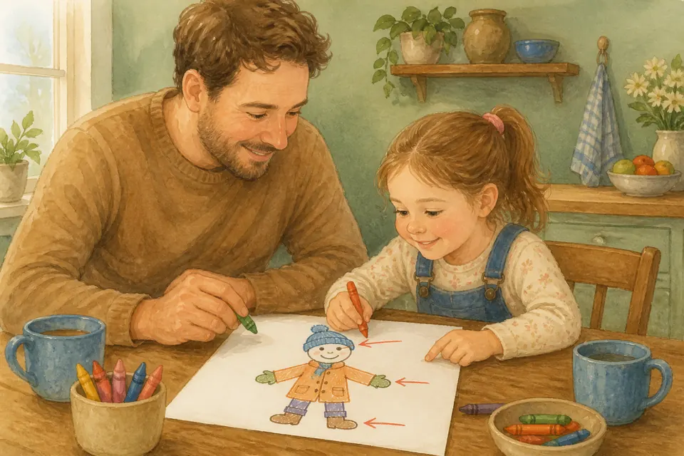{ loading=lazy }

*(Мама или папа говорит просто, без смущения и без шуток)*

У глаз есть имя. У коленки есть имя. У личных мест тоже есть настоящие имена — спокойные, не смешные и не «секретные».

У девочки грудь, попа и вульва — место между ножек под одеждой. У мальчика личное место называется пенис. Мы говорим эти слова так же обыденно, как «локоть» или «пятка». Стыда здесь нет. Бог создал тело мудро.

Зачем имена? Чтобы ты мог ясно сказать, если кому-то больно, странно или кто-то трогает то, что трогать нельзя. Непонятное слово легче спрятать. Настоящее имя помогает правде выйти к свету.

**📖 Стих из Библии:**
14. Славлю Тебя, потому что я дивно устроен. Дивны дела Твои, и душа моя вполне сознает это.
Псалом 138:14 (Синодальный перевод)

**🗣 Поговорим:**
*Родитель:* Как называются личные места у мальчика? Давай повторим спокойно вместе.
*(Дать сыну ответить; родитель помогает без смешков)*

**🙏 Наша молитва:**
«Господь, спасибо за моё тело. Научи меня говорить о нём честно и без стыда. Аминь.»

---

## Глава 189. Вопросы про тело — к маме и папе

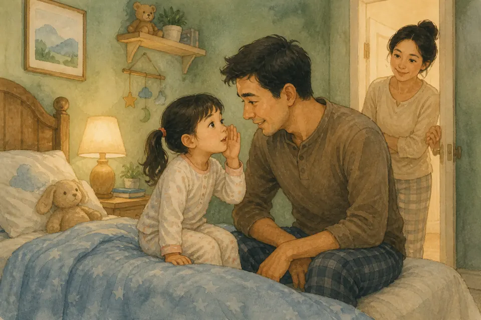{ loading=lazy }

*(Мама или папа садится ближе, будто открывает безопасную дверцу)*

Ух ты! Даже обычный день может стать квестом. В садике, во дворе или в мультике можно услышать странное про тело, про «взрослых», про малышей. Дети иногда путают, иногда хвастаются, иногда пугают.

Правило простое: **не гадай и не учись у случайных слов**. Приходи ко мне или к маме. Можно спросить шёпотом. Можно нарисовать вопрос. Можно сказать: «Я не понял, и мне неспокойно». Глупых вопросов про тело в нашей семье нет.

Мы ответим столько, сколько нужно сегодня. Остальное подождёт своего времени. Правда от своих взрослых безопаснее, чем секрет от чужих детей.

**📖 Стих из Библии:**
8. Слушай, сын мой, наставление отца твоего и не отвергай завета матери твоей, 9. потому что это - прекрасный венок для головы твоей и украшение для шеи твоей.
Притчи 1:8-9 (Синодальный перевод)

**🗣 Поговорим:**
*Родитель:* Кому ты можешь задать любой вопрос про тело?
*(Дать сыну ответить)*

**🙏 Наша молитва:**
«Бог, спасибо за маму и папу. Помоги мне спрашивать и не оставаться с путаницей в сердце. Аминь.»

---

## Глава 190. Добрые и недобрые прикосновения

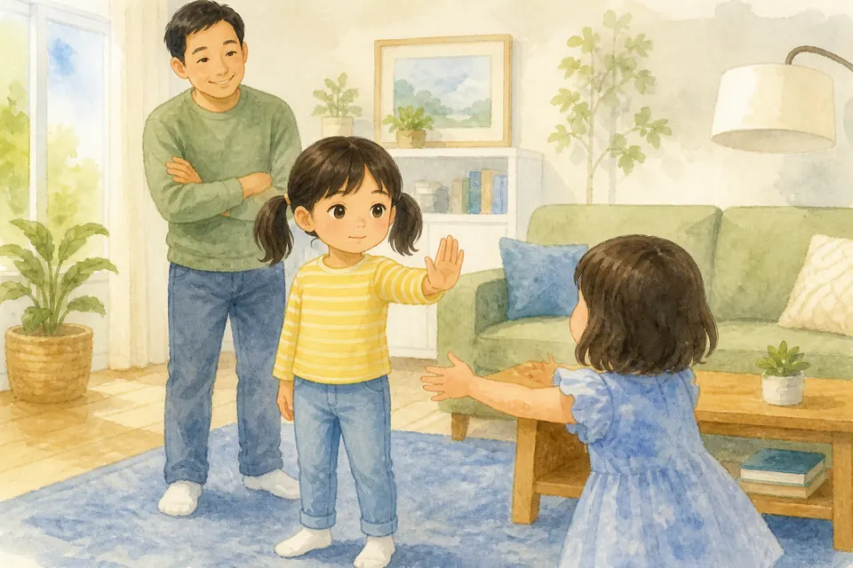{ loading=lazy }

*(Мама или папа говорит очень спокойно и серьёзно, без страха)*

Ш-ш-ш… А теперь — внимание, мой герой. Есть прикосновения добрые: объятие мамы, рука папы, когда идёте через дорогу, погладить по голове, если тебе это приятно. Такое прикосновение можно остановить: «Хватит», «Не сейчас». Твоё тело — твоё.

Есть прикосновения недобрые. Если кто-то трогает личные места под одеждой, просит тебя трогать его личные места, залезает под одежду, щекочет так, что нельзя остановить, или делает вид, будто это «игра», а тебе противно — это нельзя. Даже если человек улыбается. Даже если это другой ребёнок.

Доброе прикосновение не требует тайны. Недоброе часто шепчет: «Никому не говори». Тогда сразу иди к своим.

**📖 Стих из Библии:**
19. Не знаете ли, что тела ваши суть храм живущего в вас Святаго Духа, Которого имеете вы от Бога, и вы не свои? 20. Ибо вы куплены дорогою ценою. Посему прославляйте Бога и в телах ваших и в душах ваших, которые суть Божии.
1 Коринфянам 6:19-20 (Синодальный перевод)

**🗣 Поговорим:**
*Родитель:* Чем доброе прикосновение отличается от недоброго?
*(Дать сыну ответить)*

**🙏 Наша молитва:**
«Господь, храни моё тело. Дай мне ясность отличать доброе прикосновение от плохого. Аминь.»

---

## Глава 191. Даже знакомый может поступить плохо

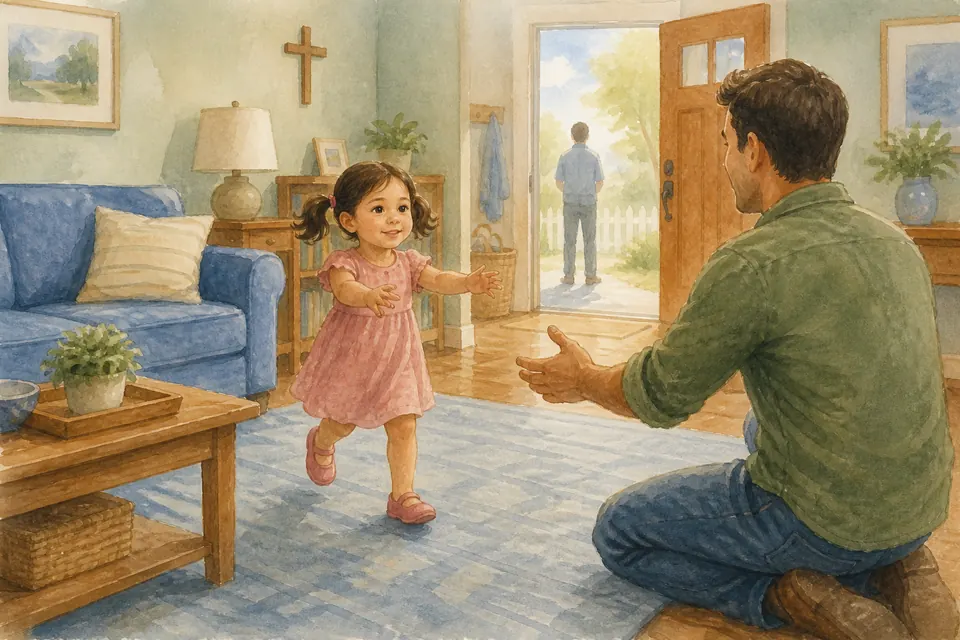{ loading=lazy }

*(Мама или папа говорит уверенно, чтобы сыну было спокойно)*

Топ-топ по полу — и мы уже в истории. Мы уже говорили про незнакомцев. Но важно знать ещё: плохо поступить может и знакомый человек. Сосед. Родственник. Старший ребёнок. Человек из церкви, кружка или садика. Тот, кто дарит подарки и кажется добрым.

Знакомое лицо не отменяет правила закрытого тела. Улыбка не делает плохое хорошим. Если сердце сжимается, если просят секрет, если трогают личное — ты не обязан слушаться из вежливости.

Безопасные взрослые — те, кого назвали мама и папа, и к кому можно прийти с правдой. Если знакомый просит скрыть что-то от нас — это уже знак идти к нам сразу.

**📖 Стих из Библии:**
23. Больше всего хранимого храни сердце твое, потому что из него источники жизни.
Притчи 4:23 (Синодальный перевод)

**🗣 Поговорим:**
*Родитель:* Можно ли знакомому человеку делать то, что нельзя незнакомцу?
*(Дать сыну ответить; папа мягко подтверждает: нет)*

**🙏 Наша молитва:**
«Бог, дай мне мудрость. Помоги не путать знакомство с безопасностью. Аминь.»

---

## Глава 192. Хитрая «игра» и особые подарки

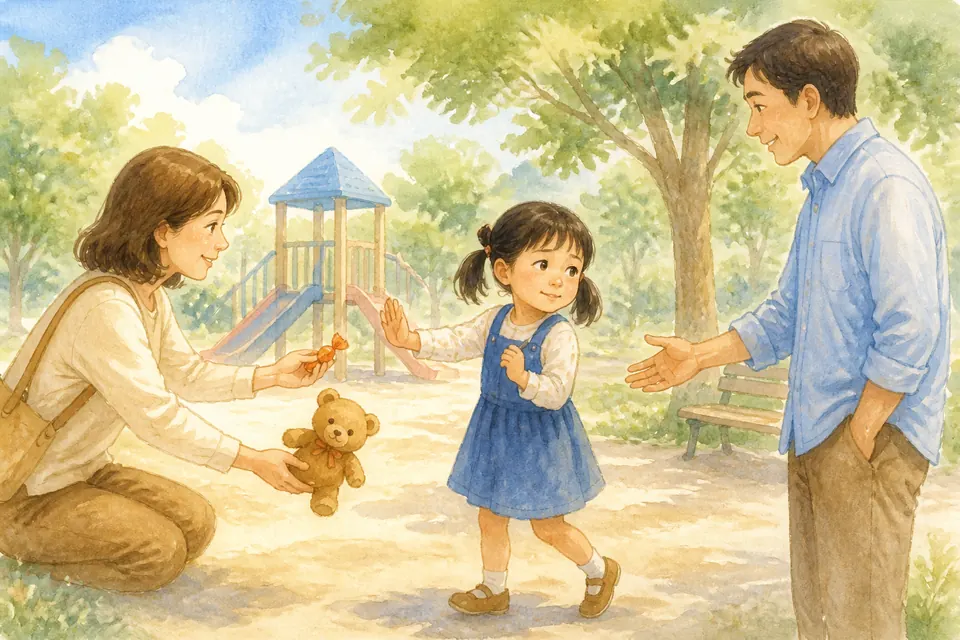{ loading=lazy }

*(Мама или папа говорит ясно, как про важное правило)*

Слышишь? Как будто где-то стучит барабан приключения… Иногда плохое прячется в сладких словах. «Это наша особая игра». «Ты моя самая любимая, только никому». «Если расскажешь, я обижусь». «Возьми конфету — и молчи». «Покажи, я никому не скажу».

Добрая игра можно остановить. Добрый подарок не покупает молчание. Добрая любовь не просит тайны от мамы и папы.

Если кто-то даёт лишние подарки, зовёт побыть наедине без разрешения, просит сесть на колени, когда не хочется, или говорит, что родители «не поймут», — это хитрость. Не спорь долго. Скажи **«Нет»**, уйди и расскажи нам. Мы не рассердимся на тебя.

**📖 Стих из Библии:**
15. Глупый верит всякому слову, благоразумный же внимателен к путям своим.
Притчи 14:15 (Синодальный перевод)

**🗣 Поговорим:**
*Родитель:* Какие слова должны сразу привести тебя ко мне или к маме?
*(Дать сыну ответить)*

**🙏 Наша молитва:**
«Господь, научи меня замечать хитрость и сразу идти к своим. Аминь.»

---

## Глава 193. Если бьют, держат или сильно пугают

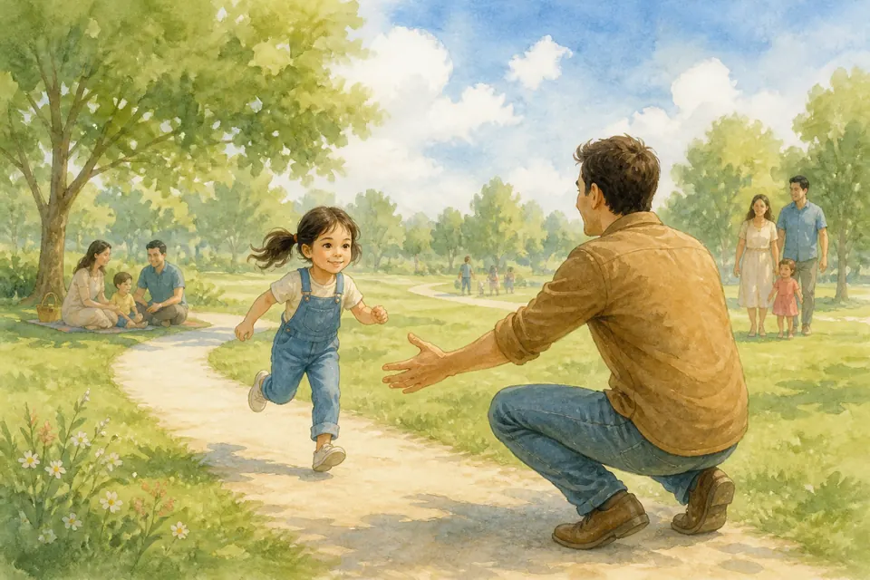{ loading=lazy }

*(Мама или папа берёт сына за руку и говорит твёрдо)*

Раз-два! Ноги уже готовы бежать. Никто не имеет права бить тебя, сильно сжимать, запирать в комнате, закрывать рот, тащить за собой или пугать так, чтобы ты замолчал. Ни взрослый, ни другой ребёнок. Даже если говорят: «ты сам виноват» или «это воспитание».

Боль, страх и сильные руки — не игра. Можно громко кричать: **«Нельзя! Помогите!»** Можно вырвать руку, убежать к людям, звать меня, маму, воспитателя, охрану. Вежливость не важнее безопасности.

Бог не хочет, чтобы детям делали больно. Защищаться и звать на помощь — это не злость. Это мудрость.

**📖 Стих из Библии:**
1. Господь - свет мой и спасение мое: кого мне бояться? Господь крепость жизни моей: кого мне страшиться?
Псалом 26:1 (Синодальный перевод)

**🗣 Поговорим:**
*Родитель:* Что ты сделаешь, если кто-то начнёт бить или держать тебя?
*(Дать сыну ответить; вместе повторить: кричать, уходить, рассказывать)*

**🙏 Наша молитва:**
«Иисус, защити меня. Дай голос и ноги, если станет опасно. Аминь.»

---

## Глава 194. Кричи. Уходи. Расскажи. И ещё раз

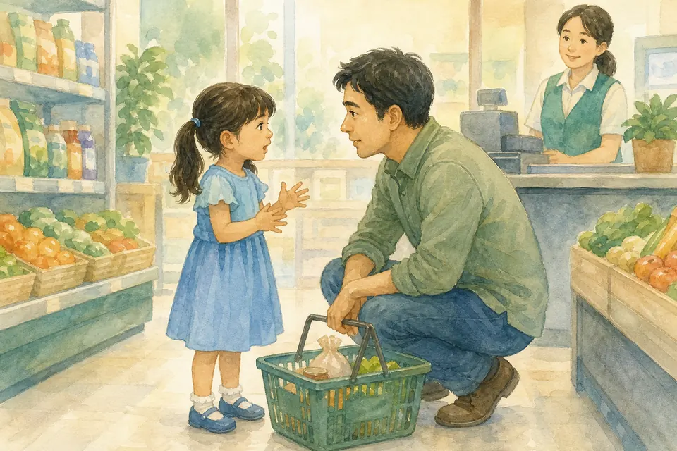{ loading=lazy }

*(Мама или папа отрабатывает план, как маленькую тренировку)*

Представь: ты и мама с папой — одна команда. Запомни четыре шага — как ремень безопасности:

1. Громко скажи **«Нет!»** или **«Помогите!»**
2. **Уйди** туда, где есть люди.
3. **Расскажи** маме, папе или другому безопасному взрослому.
4. Если первый взрослый не услышал, занят или не поверил — **расскажи ещё раз** другому.

Ты не обязан объяснять красиво. Можно сказать: «Мне было страшно. Он трогал личное. Она била. Он сказал никому не говорить». Мы будем слушать. Если я мою посуду или говорю по телефону — всё равно прерви меня. Это важнее.

Помощь приходит, когда правда выходит из темноты.

**📖 Стих из Библии:**
10. не бойся, ибо Я с тобою; не смущайся, ибо Я Бог твой; Я укреплю тебя, и помогу тебе, и поддержу тебя десницею правды Моей.
Исаия 41:10 (Синодальный перевод)

**🗣 Поговорим:**
*Родитель:* Давай повторим шаги: нет — уйти — рассказать — рассказать ещё раз. Кому расскажешь, если я вдруг не услышал?
*(Дать сыну ответить; родитель называет 2–3 безопасных взрослых)*

**🙏 Наша молитва:**
«Бог, дай мне смелость кричать, уходить и рассказывать, пока мне не помогут. Аминь.»

---

## Глава 195. Ты не виноват

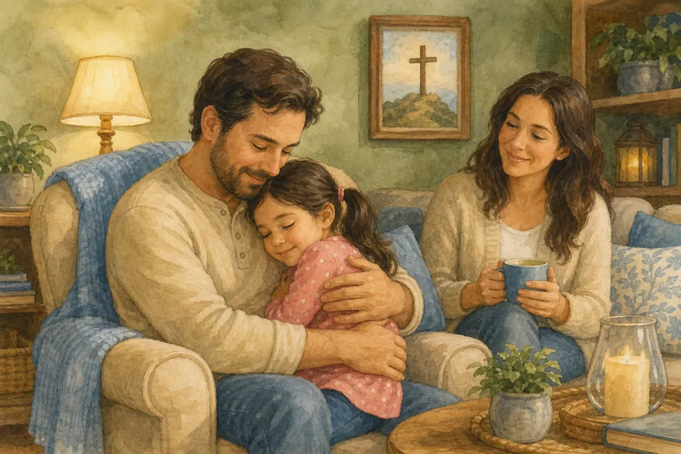{ loading=lazy }

*(Мама или папа смотрит сыну в глаза и говорит очень нежно)*

Бах! День начинается с маленького подвига. Если кто-то поступил плохо с твоим телом или ударил тебя — **ты не виноват**. Даже если ты замер и не крикнул. Даже если взял конфету. Даже если это был человек, которого ты любила. Даже если ты не сразу рассказал. Даже если игра сначала казалась обычной.

Виноват тот, кто сделал плохое. Дети не отвечают за чужой плохой выбор. Стыд часто хочет сесть на плечи тому, кого обидели. Мы этот стыд снимаем.

Рассказать нам — храбрость. Мы не прогоним тебя. Мы не будем злиться на тебя за правду. Мы обнимем и защитим.

**📖 Стих из Библии:**
13. ибо Я Господь, Бог твой; держу тебя за правую руку твою, говорю тебе: "не бойся, Я помогаю тебе."
Исаия 41:13 (Синодальный перевод)

**🗣 Поговорим:**
*Родитель:* Чья это вина, если взрослый или ребёнок поступает с тобой плохо?
*(Дать сыну ответить)*

**🙏 Наша молитва:**
«Господь, сними с меня чужой стыд. Научи меня знать: я любима, и правда безопасна дома. Аминь.»

---

## Глава 196. Никаких фото личных мест

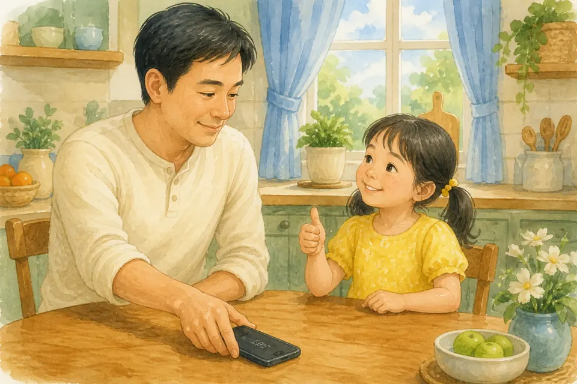{ loading=lazy }

*(Мама или папа показывает телефон и кладёт его экраном вниз)*

Тук-тук сердце. Сейчас будет важный секрет. Фото радости — можно: торт, качели, улыбка, если ты согласна. Но никто не должен снимать тебя без одежды, в ванне, на горшке, в туалете или просить показать личные места в камеру. Ни взрослый, ни ребёнок. Ни «для игры», ни «для секрета», ни «потом удалим».

Если кто-то показывает такие картинки или просит тебя сделать снимок — скажи **«Нет»**, отойди и сразу расскажи нам. Ты не попадёшь в беду за правду. Экран не имеет права на твоё тело.

Чужой телефон и чужие «тайные» фото — не место для мальчики. Мы смотрим вместе и с разрешения.

**📖 Стих из Библии:**
8. Что только истинно, что честно, что справедливо, что чисто, что любезно, что достославно, что только добродетель и похвала, о том помышляйте.
Филиппийцам 4:8 (Синодальный перевод)

**🗣 Поговорим:**
*Родитель:* Что делать, если кто-то просит сфотографировать тебя без одежды или показывает такое фото?
*(Дать сыну ответить)*

**🙏 Наша молитва:**
«Бог, храни моё тело и на фотографиях. Дай смелость сказать “нет” и сразу рассказать своим. Аминь.»

---

## Глава 197. Осмотр тела — только с мамой или папой

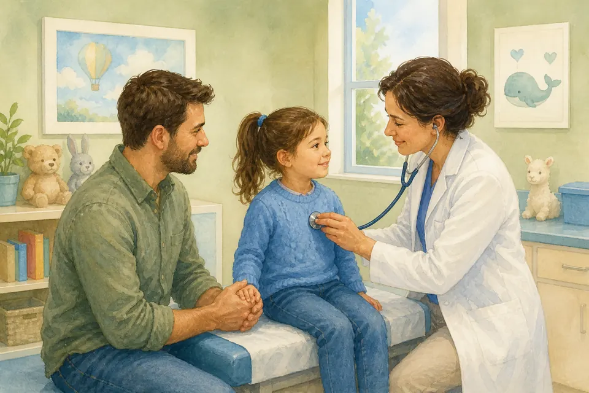{ loading=lazy }

*(Мама или папа объясняет спокойно, как про визит к врачу)*

Ух ты! Даже обычный день может стать квестом. Иногда телу нужна помощь врача: посмотреть горло, ушко, животик, кожу. Это забота, не тайна. Мама или папа остаются рядом. Если врач просит остаться наедине «просто проверить» личные места без нас — правило такое: **нет**. Мы идём вместе или просим другого врача.

Воспитатель, сосед, родственник, старший ребёнок не осматривают личные места под одеждой. «Дай посмотреть, не болит ли» без мамы и папы — не подходит. Можно сказать: «Только с мамой или папой».

Здоровье важно. И границы тоже важны. Бог дал тебе тело — и дал семью, которая его бережёт.

**📖 Стих из Библии:**
1. Живущий под кровом Всевышнего под сенью Всемогущего покоится, 2. говорит Господу: "Ты кров мой, Ты прибежище мое, Бог мой, на Тебя уповаю."
Псалом 90:1-2 (Синодальный перевод)

**🗣 Поговорим:**
*Родитель:* Кто может быть рядом, если врачу нужно осмотреть тело?
*(Дать сыну ответить)*

**🙏 Наша молитва:**
«Господь, благослови врачей. Научи меня не оставаться одной, когда осматривают тело. Аминь.»
